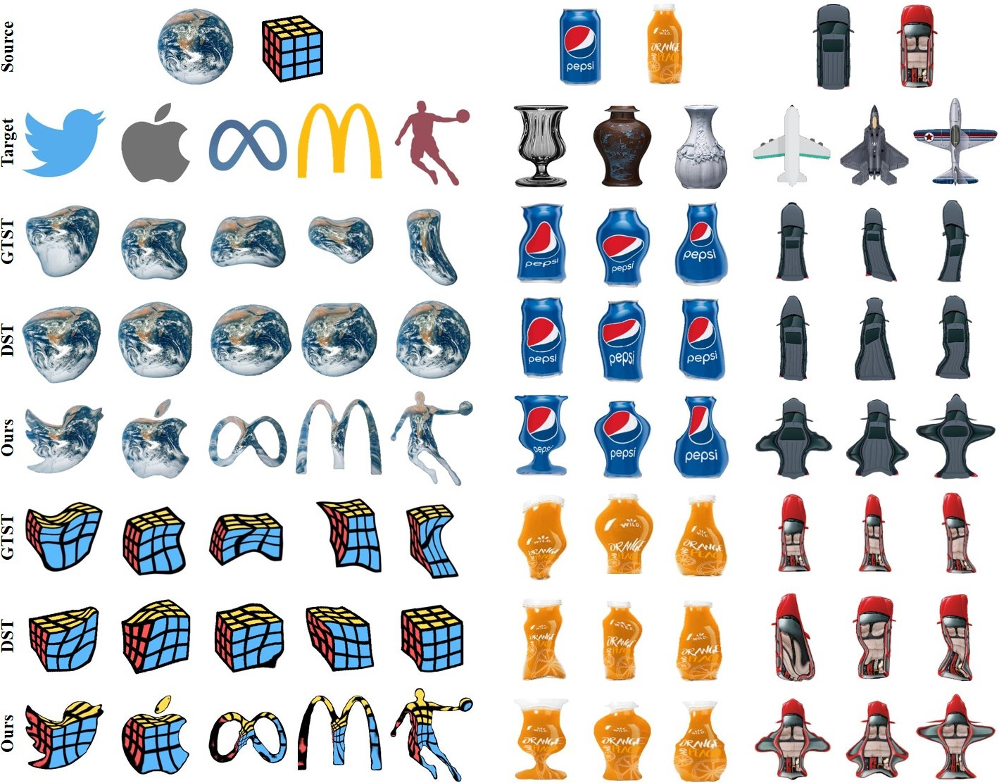

# InST: Industrial Style Transfer with Large-scale Geometric Warping and Content Preservation
<!-- **Industrial Style Transfer with Large-scale Geometric Shape** -->

 

## Results
### Large-scale Geometric Warping

 

### Texture Style Transfer

 

### Geometry&Texture

 

 

## References
[1] Xiao-Chang  Liu,  Yong-Liang  Yang,  and  Peter  Hall. Learning to warp for style transfer.   In CVPR, pages 3702–3711, 2021  
[2] Sunnie S. Y. Kim, Nicholas I. Kolkin, Jason Salavon,and Gregory Shakhnarovich.  Deformable style trans-fer.   In ECCV, pages 246–261,  2020. 