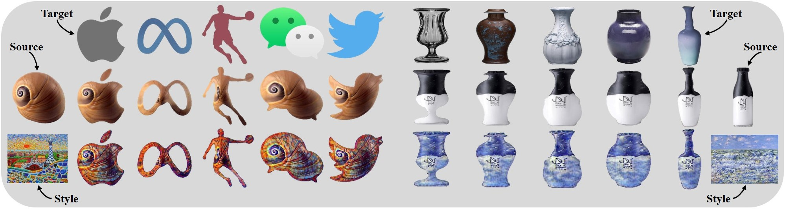
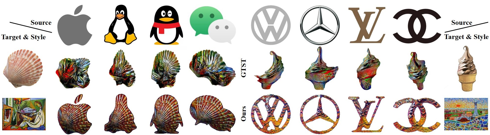

# InST: Industrial Style Transfer with Large-scale Geometric Warping and Content Preservation
<!-- **Industrial Style Transfer with Large-scale Geometric Shape** -->

 

## Results
### Large-scale Geometric Warping

 
 Warping results using the geometric style transfer methods, e.g., <a href='#GTST'>GTST</a>, <a href='#DST'>DST</a> and our InS [123](#GTST)

### Texture Style Transfer with Content Preservation

 
 Content preservation results using the texture style transfer methods, e.g., <a href='#Adain'>AdaIN</a>, <a href='#LinearWCT'>LinearWCT</a> and <a href='#Artflow'>ArtFlow</a> 

### Geometry&Texture

 
  Visual logo design results using the geometric and texture style transfer methods, e.g., <a href='#GTST'>GTST</a> and our InS

 
  Visual product design results using the geometric and texture style transfer methods, e.g., <a href='#GTST'>GTST</a> and our InS

## References
[1] Xiaochang Liu, Yongliang  Yang, and Peter Hall. Learning to warp for style transfer. In CVPR, pages 3702–3711, 2021    
[2] Sunnie S. Y. Kim, Nicholas I. Kolkin, Jason Salavon, and Gregory Shakhnarovich. Deformable style transfer. In ECCV, pages 246–261, 2020    
[3] Xun Huang and Serge J Belongie. Arbitrary style transfer in real-time with adaptive instance normalization. In ICCV, pages 1501–1510, 2017    
[4] Xueting  Li,  Sifei  Liu,  Jan  Kautz,  and  Minghsuan Yang.   Learning linear transformations for fast arbitrary style transfer. In CVPR, pages 3809–3817, 2019    
[5] Jie An,  Siyu Huang,  Yibing Song,  Dejing Dou,  Wei Liu,  and Jiebo Luo.   Artflow:  Unbiased image style transfer via reversible neural flows.  In CVPR, pages 862–871, 2021
