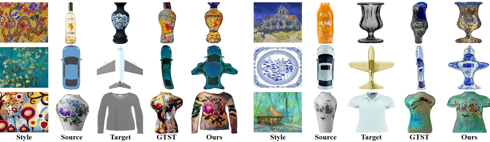

# InST: Industrial Style Transfer with Large-scale Geometric Warping and Content Preservation
<!-- **Industrial Style Transfer with Large-scale Geometric Shape** -->

 

## Results
### Large-scale Geometric Warping

 

### Texture Style Transfer with Content Preservation

 

### Geometry&Texture

 

 

## References
[1] Xiaochang Liu, Yongliang  Yang, and Peter Hall. GTST: Learning to warp for style transfer. In CVPR, pages 3702–3711, 2021  
[2] Sunnie S. Y. Kim, Nicholas I. Kolkin, Jason Salavon, and Gregory Shakhnarovich. DST: Deformable style transfer. In ECCV, pages 246–261, 2020  
[3] Xun Huang and Serge J Belongie. Adain: Arbitrary style transfer in real-time with adaptive instance normalization. In ICCV, pages 1501–1510, 2017  
[4] Xueting  Li,  Sifei  Liu,  Jan  Kautz,  and  Minghsuan Yang.   LinearWCT: Learning linear transformations for fast arbitrary style transfer. In CVPR, pages 3809–3817, 2019  
[5] Jie An,  Siyu Huang,  Yibing Song,  Dejing Dou,  Wei Liu,  and Jiebo Luo.   Artflow:  Unbiased image style transfer via reversible neural flows.  In CVPR, pages 862–871, 2021
